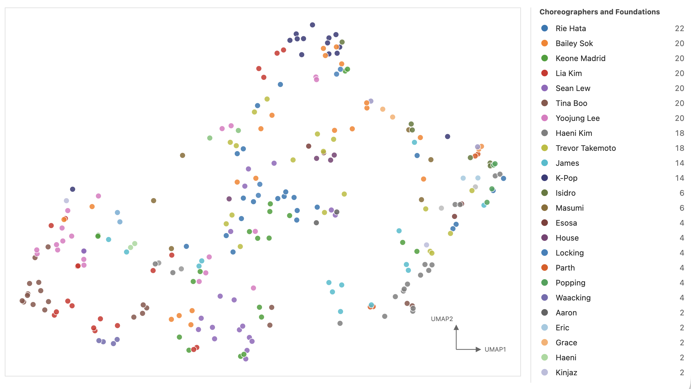

# DanceVerse Prototype

This is a prototype for DanceVerse, a visualization of a 'universe' of choreography videos, clustered based on choreographic style and movement qualities. 

Click on the figure below to check out the interactive plot!

[](https://ajkim000.github.io/danceverse-prototype/danceverse-prototype.html)

## Setup

```bash
python -m venv venv
source venv/bin/activate
pip install -r requirements.txt
cp .env.example .env
```

Then add your Gemini API key to `.env`:

```text
GEMINI_API_KEY=your_api_key_here
```

Do not commit `.env`.

## Basic Pipeline

1. Prepare short `.mp4` dance clips locally.
2. Run `get_descriptions.py` to generate comparative choreography descriptions.
3. Run `get_movement_timeline.py` to generate interval-level movement labels.
4. Run `get_embeddings.py` to embed the descriptions.
5. Run `combine_timeline_embeddings.py` to concatenate description embeddings with movement timeline features.
6. Use the resulting vectors for clustering or projection plots.
